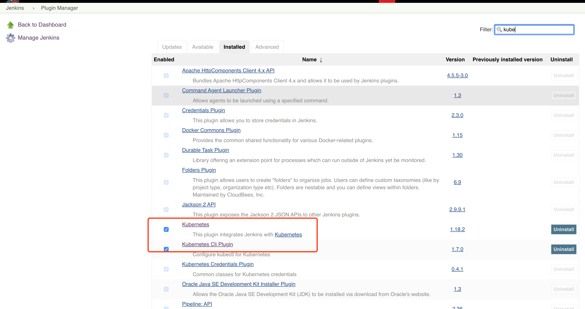

gitlab + jenkins + kubernetes
## Kubernetes CI/CD实践

## 前言
应对敏捷开发的需求，对CI(持续集成))/CD（持续交付）的提出了更高的标准，今天来讨论下，如何基于开源组件（gitlab/jenkins/harbor/kubernetes）使用CI/CD，赋能团队的开发、运维。

## 核心组件
组件名称| 版本 | 备注 
------ | ------| ------|
kubernetes  | v1.15.3 |  |
jenkins  | 2.176.2 | 集群内部署/ namespace: devops |
gitlab  | 11.8 | 主机部署 |
harbor  | v1.7.4 | docker-compose部署| 

## 基本流程

1. 在GitLab创建对应的项目。
2. 开发者将代码提交到GitLab。
3. Jenkins创建对应的任务（Job），集成该项目的Git地址和Kubernetes集群。
4. 如有配置钩子，推送（Push）代码会自动触发Jenkins构建，如没有配置钩子，需要手动构建。
5. Jenkins控制Kubernetes（使用的是Kubernetes插件）创建Jenkins Slave。
6. Jenkins Slave根据流水线（Pipeline）定义的步骤执行构建。
    1. 检出代码、打包、编译；
    2. 通过Dockerfile生成镜像。
    3. 将镜像提送（Push）到私有Harbor。
    4. Jenkins再次控制Kubernetes进行最新的镜像部署。


__注__: 
    
* 上面所述为一般步骤，中间还可能会涉及自动化测试等步骤，可自行根据业务场景添加。

* 上面流水线步骤一般由应用代码库的根目录下Jenkinsfile决定，Jenkins会自动读取该文件；另外如果需要对具体的应用流水线实施强管控，可以独立管理jenkinsfile模板，然后根据jenkins API接口即时生成流水线。

* 默认使用的Dockerfile放置在代码仓库的根目录下。

## 组件部署
1. kubernetes【Kubernetes系列】第3篇 Kubernetes集群安装部署
2. gitlab 无忌过招:手把手教你搭建自己的GitLab库
3. harbor [安装配置指南](https://github.com/goharbor/harbor/blob/v1.7.4/docs/installation_guide.md)
4. jenkins 

_注_: 本文主要说明下jenkins的部署及配置，其他组件如果你部署有问题，欢迎留言。

## Jenkins 部署及配置
_说明_: 
    
* 以下的yaml文件均在 k8s master节点的 /home/jenkins_deploy目录下，
* 部署示例的depployment.yaml 的注解
    * `nodeName ipaddress` , ipaddress 请确认其为一个有效的ip.
    * 示例中jenkins的目录 `/var/jenkins_home` 是直接挂载到host_path, 如果你有条件，建议替换为共享存储。
    * 因使用的jenkins-master 的基础镜像来自公网，需要k8s maste 节点也要可以访问外网，或者你可以将 `jenkins/jenkins:lts-alpine` 推送至自己的内网镜像仓库。

* 部署示例的ingress.yaml 的注解
    * 需要你也需要办公网（集群外）访问，请将`jenkins.dev.hanker.net`, 改为有效的域名地址，或是你也可以通过`NodePort`的形式声明 service，就可以直接通过`ip:port`的形式访问jenkins了。

### 1. 准备部署yaml
* deployment.yaml

```
apiVersion: v1
kind: Namespace
metadata:
  name: devops
  
# Deployment 
apiVersion: extensions/v1beta1
kind: Deployment
metadata:
  name: jenkins
  namespace: devops
spec:
  replicas: 1
  revisionHistoryLimit: 3
  template:
    metadata:
      labels:
        app: jenkins
    spec:
      nodeName: 1.1.1.1
      serviceAccountName: jenkins-admin
      containers:
      - image: jenkins/jenkins:lts-alpine
        imagePullPolicy: IfNotPresent
        name: jenkins
        volumeMounts:
        - name: jenkins-volume
          mountPath: /var/jenkins_home
        - name: jenkins-localtime
          mountPath: /etc/localtime
        env:
          - name: JAVA_OPTS
            value: '-Xms256m -Xmx1024m -Duser.timezone=Asia/Shanghai'
          - name: TRY_UPGRADE_IF_NO_MARKER
            value: 'true'
        ports:
        - name: http
          containerPort: 8080
        - name: agent
          containerPort: 50000
        resources:
          requests:
            cpu: 1000m
            memory: 1Gi
          limits:
            cpu: 1200m
            memory: 2Gi
      volumes:
        - name: jenkins-localtime
          hostPath:
            path: /etc/localtime
        - name: jenkins-volume
          hostPath:
            path: /home/jenkins/jenkins_home
```

* 配置service, services.yaml

```
---
apiVersion: v1
kind: Service
metadata:
  name: jenkins-service
  namespace: devops
spec:
  ports:
  - name: http
    protocol: TCP
    port: 8080
    targetPort: 8080
  - port: 50000
    targetPort: 50000
    name: agent
  selector:
    app: jenkins
```

* 授权jenkins对k8s的访问 rbac.yaml 

```
apiVersion: v1
kind: ServiceAccount
metadata:
  labels:
    k8s-app: jenkins
  name: jenkins-admin
  namespace: devops

---

apiVersion: rbac.authorization.k8s.io/v1beta1
kind: ClusterRole
metadata:
  name: jenkins-rbac
  namespace: devops
rules:
  - apiGroups: ["","extensions","app"]
    resources: ["pods","pods/exec","deployments","replicasets"]
    verbs: ["get","list","watch","create","update","patch","delete"]

---

apiVersion: rbac.authorization.k8s.io/v1beta1
kind: ClusterRoleBinding
metadata:
  name: jenkins-admin
  namespace: devops
  labels:
    k8s-app: jenkins
subjects:
  - kind: ServiceAccount
    name: jenkins-admin
    namespace: devops
roleRef:
  kind: ClusterRole
  name: jenkins-rbac
  apiGroup: rbac.authorization.k8s.io
```

* 为了便于办公网（集群外）访问，ingress.yaml

```
apiVersion: extensions/v1beta1
kind: Ingress
metadata:
  name: jenkins-ingress
  namespace: devops
spec:
  rules:
  - host: jenkins.dev.hanker.net
    http:
      paths:
      - backend:
          serviceName: jenkins-service
          servicePort: 8080
        path: /
```

### 2. 应用yaml，部署jenkins

```
$ pwd
$ /home/jenkins_deploy
$ kubectl apply -f *.yaml
```

### 3. 确认jenkins 服务状态

```
[root@node0 jenkins_deploy]# kubectl -n devops get deployment jenkins
NAME      READY   UP-TO-DATE   AVAILABLE   AGE
jenkins   1/1     1            1           51d
[root@node0 jenkins_deploy]# 
```

### 4. 访问jenkins 安装插件、设置

_注:_ 步骤1 声明的域名 `jenkins.dev.hanker.net` 已经解析至ingress，故可直接访问； 如果你也想通过自定义域名访问jenkins，麻请解析至正确的ingress服务节点，即可。

1. 确认你也已经安装了kubernetes 插件

_操作指引_： 【Manage Jenkins】 -> 【Manage Plugins】



2. 配置Kubernetes 插件

_操作指引_： 【Manage Jenkins】->【Configure System】 


_图中标注：_

    1. 请修改为你所在环境对应的k8s master

    2. 声明jenkins-agent 的命令空间，也可以根据需要调整；
    3. jenkins-master的访问地址，本示例使用的是 service-name的形式访问。


3. 测试与k8s分享群的连接情况。

4. 配置Kubernetes Pod Template

    * Docker image
    * Working directory
    * Host Path Volume


## CI/CD流程

### 1. 准备基础数据
1. 配置gitlab
2. 配置harbor
3. jenkins 验证信息

### 2. 创建jenkins job


### 3. 结果确认

