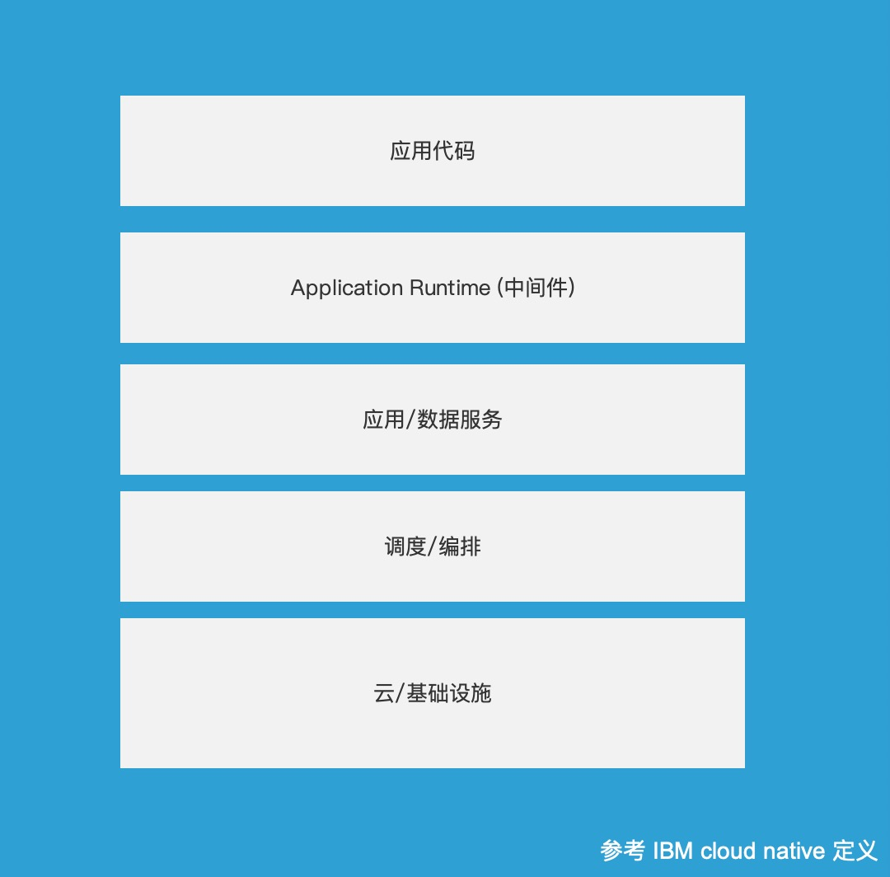
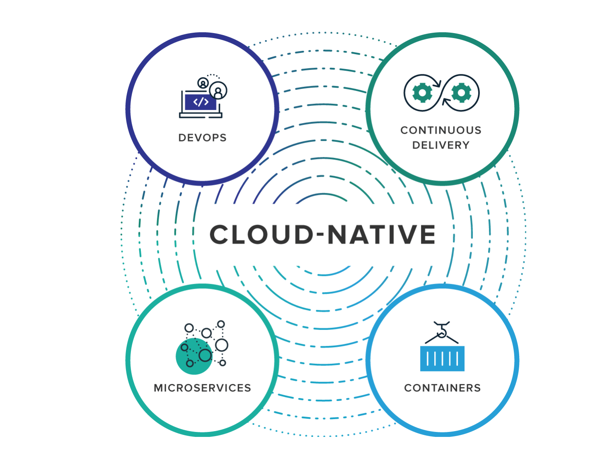
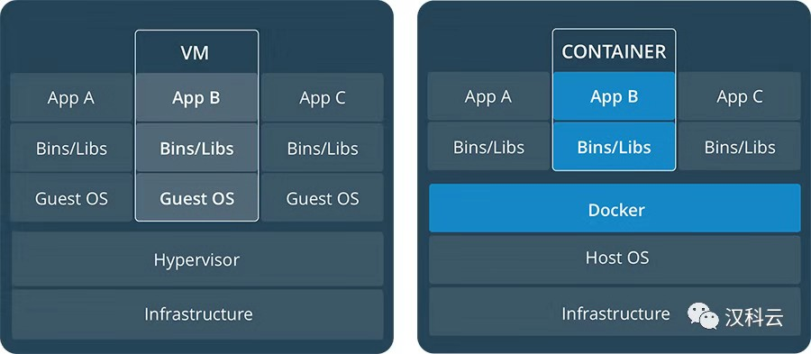
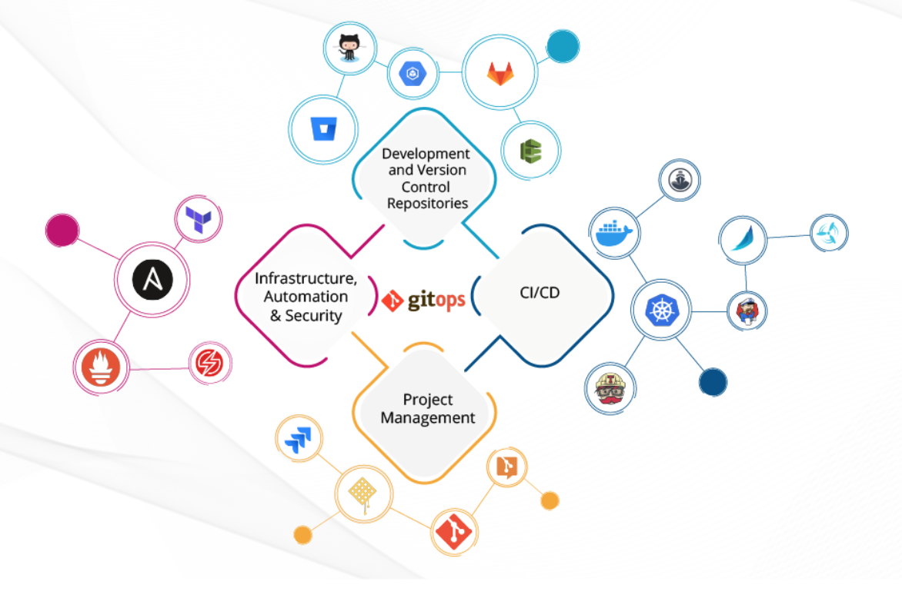

# 云原生距离我们有多远

## 目录
1. 何为云原生
2. 云原生-容器编排kubernetes
3. 云原生-DevOps方案
4. 结论

## 引言
现在越来越多的企业上云，用云，但云原生离我们真的又有多远呢，期望本篇可以让你有些收获, 如果有不妥的地方，期望大家后台留言，共同交流。

## 1. 何为云原生
### 1.1 云原生概念

在介绍之前，期望跟大家聊下为什么会产生云原生？

在传统的模式下，我们更多的是创建一个较大的应用，对于它的创建、运行、升级、维护都是比较痛苦的事情，
而当下云计算或是云的概念大家都已经不再陌生（谁还没一台云主机服务器呀，用于创建自己的博客或是科学上网等等），因为现在有很多的机会让我们接触到公有云（阿里云/腾讯云等）或是私有云，那我们对于应用的管理方式是不是也应该有一种当下的方式，我们就称其为云原生的方式。

因为云技术在不断发展的情况下，逐渐成熟，也促进很多的技术的商品化，层次化，我们不需要自建机房，可以不用自己安装数据库服务器等等，下面我们就基于IBM对于cloud native的对于层的定义，聊聊云原生

* 云/基础设施： 可以是公有云、私有云、混合云或是自己的本地数据机房。
* 调度/编排： 比如我们熟悉的kubernetes
* 应用/数据服务： 后端服务
* 中间件：中间件服务
* 应用代码：云原生应用 

云原生，__一般来说__，云原生就一种利用云计算交付模型构建、运行应用的方式。 也就是说云原生关注的如何构建、部署应用，而并不关注在哪里，或是说所有的公有/私有云均可以成为这个地方。

#### CNCF的云原生定义
CNCF也有一个相对较窄的定义，使用开源软件栈,每个部分的应用程序打包在自己的容器,动态编排每个部分是积极安排和管理,优化资源利用,和microservices-oriented增加整个应用程序的灵活性和可维护性。

<!-- ### 1.2 价值
1. 创新（速度、扩展性、效率、容量、标准化）
2. 业务敏捷性（持续交付、敏捷开发等）
3. 促进技术产品商品化 -->

### 1.2 云原生-我们真正需要的是什么？

首先对于当前云的转型期中，我们真正需要的是什么?
1. 尽快地迁移至云上（云迁移）;
2. 降低运维、基础设施及人员成本(降低成本);
3. 减少完成项目所需的时间(敏捷、快速上线);
4. 拥有可靠的系统。（提升质量）。

## 2. 云原生-容器编排kubernetes

清楚了我们的目标，但我们又应该如何做呢？也许你已经迷失在丰富的解决方案中，尤其是对于那些新手用户。但是糟糕的是你不能失败。因为不管是否有云，一个项目必须在今天或是明天上线，那时将需要更敏捷、更有质量。

这也许就是为什么我们已经听到云时代已经到来却很难启程的原因，因为你必须投注正确的一匹马，而且不能输。下面我跟大家聊聊值得我们每个人下注的马--kubernetes。

### 2.1 为什么需要容器
在聊kubernetes之前， 先认识下容器，容器是将生产带入了我们的本地环境，无需再担心Linux或Windows的兼容性。此外不论是本地开发和持续集成均使用相同的方式构建镜像（均依赖于相同的Dockerfile）。

可以构建容器镜像并将其推送到镜像仓库，然后可以将它们拉出并部署到任何地方-台式机、虚拟机（本地或云中）或无服务器解决方案。 与虚拟机相比，容器的真正优势在于，它们可以虚拟化操作系统而不是资源。 这意味着可以更轻松，更灵活，更经济地托管应用程序。

https://medium.com/better-programming/why-kubernetes-bbb7d66fccf5

<!-- Docker是一个用于开发，交付和运行应用程序的开放平台。 Docker使您能够将应用程序与基础架构分开，从而可以快速交付软件。 借助Docker，您可以以与管理应用程序相同的方式来管理基础架构。 通过利用Docker的快速交付，测试和部署代码的方法，您可以大大减少编写代码和在生产环境中运行代码之间的延迟。 -->

### 2.2 kubernetes是什么

上一节我们聊了为什么需要迁移至容器，但是为什么我们还需要kubernetes。也许你已经认识到必须使用容器，但这也引入了新的需求， 我们该如何管理它们？如何才能可靠地编排？ 很显然这些问题的答案是Kubernetes。

Kubernetes(K8s) 用于自动化部署、扩展和管理容器化应用程序的开源系统。使用k8s您只需要将映像推送到docker镜像仓库并等待即可。 所有部署部分均由Kubernetes管理，因此不必担心基础架构。

k8s有很多优点，比如扩展性（您只需要部署一个容器。 然后您可以毫不费力地设置缩放策略【增加或是减少】）、版本控制（每个部署都是版本化的）等等。 
<!--  -->
同时Kubernetes简化了所有DevOps的工作, 开发人员和运营团队之间的摩擦减少了，因为责任与透明度之间明显分开。

### 2.3 体验kubernetes 
1. https://www.katacoda.com/courses/kubernetes/playground
2. https://minikube.sigs.k8s.io/

### 2.4 企业内如何落地k8s

如果我明天必须设计架构，尤其是针对企业解决方案，则我将容器和Kubernetes作为首选。不论当前的环境是私有云或是公有云, 使用k8s可以很大程度的降低我们的运维成本，并且推荐使用基于Git上托管的配置文件的DevOps管道（GitOps）。 

## 3. 云原生-DevOps方案

『云原生』改变了很多，但是我们对直接的变化就是『devops的流程』。我们的开发与运维不再是割裂的状态， 开发环境代码的变化不再是有开发者提交后代码通知运维然后上传更新的状态， 而是由开发者的变更触发相应流水线上环境代码的变化，也就是GitOps.

GitOps是一套方法论，所以其实是有多种实践的方式的，会有多种多样的好用的工具，比如使用 draft 可以帮助完成应用编排模板的自动化生成，skaffold 用来简化应用构建部署流程，kaniko 可以实现不依赖 docker daemon 的镜像构建和推送，helm 用作应用的包管理工具，还有其他 cicd 引擎像 jenkins，tekton，argo 以及为云原生而生的 jenkinsx 等等。

对于运维同学，当然期望的是环境尽量不要变更，因为变更就意味着风险、bug等，而开发同学则期望自己的尽快上线（不管是被动还是主动）。为了减少这些扯皮，也许你应该考虑新的交付方式（GitOps）了，也就是"任何的变更上线不应该是人来决定的，而是应该由代码或是说配置决定的"。 

## 4. 结论
### 4.1 云原生的思考
在1.1章节中我们看到对于云原生层的定义，并不是独立的一块一块的，还是有相互依赖的层次关系，我们需要新的模式来定义这个改变--Paas(平台即服务)。

也许你感觉并不需要一个真正的paas平台，但它真的可以让很多事情容易很多，就像你感觉之前你不需要用云主机一样。但是随着每个层次的不断抽象、商品化，PaaS就像一个额外的层来抽象底层操作系统，让您可以完全专注于应用程序的业务逻辑，而不必担心进行操作系统调用。

对于抽象出来的PaaS层企业可以选择自建或是采购服务，比如[汉科云](https://www.hankercloud.com)等服务提供商，就像现在很多企业上云而不在使用自己物理主机一样，采购是一个不错的选择。

### 4.2 需要怎样的人才/团队

云原生正在改变着团队、文化和技术，利用自动化和架构来管理复杂性和释放速度。在这种模式下运营，不仅是一种技术层面的方式，也是一种衡量人才层面的方式。

Cloud Native的真正价值远远超出了与它密切相关的技术。世界一直在不断变化，能决定我们企业的未来，我想一定少不了快速、稳定。

[汉科云团队](https://www.hankercloud.com)致力于提供快速、稳定的云原生paas平台，专业的团队服务您专业的产品，不惧未来。

Refer TO: 
1. https://www.infoworld.com/article/3281046/what-is-cloud-native-the-modern-way-to-develop-software.html
2. https://blog.heptio.com/cloud-native-part-1-definition-716ed30e9193)
3. https://medium.com/better-programming/why-kubernetes-bbb7d66fccf5

