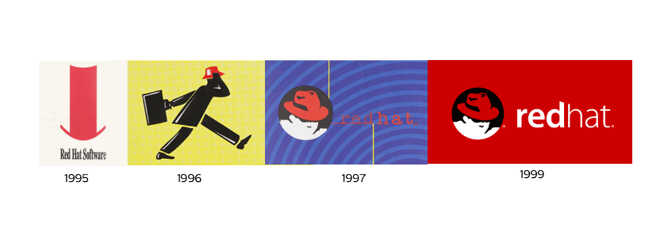
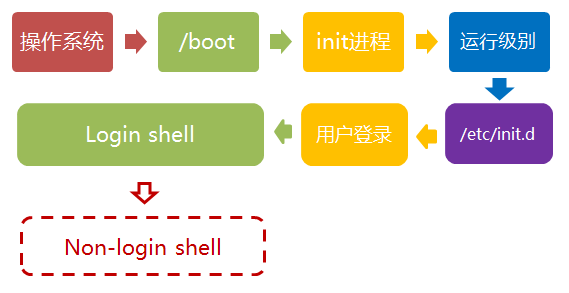
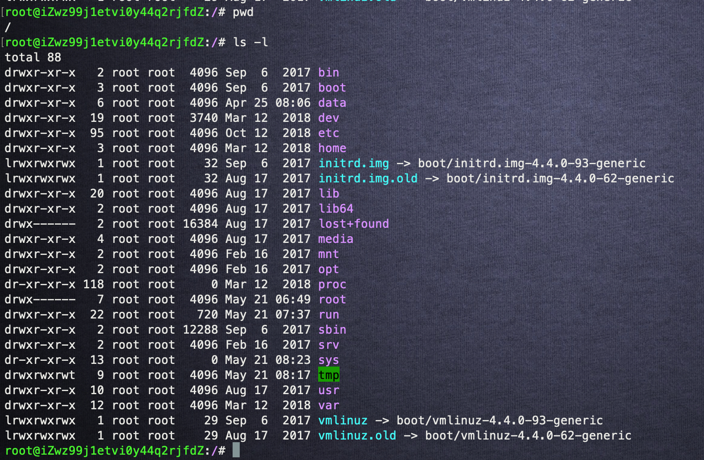
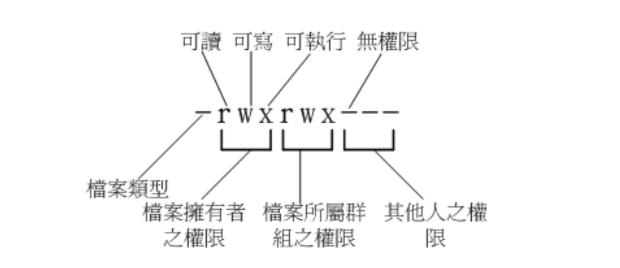
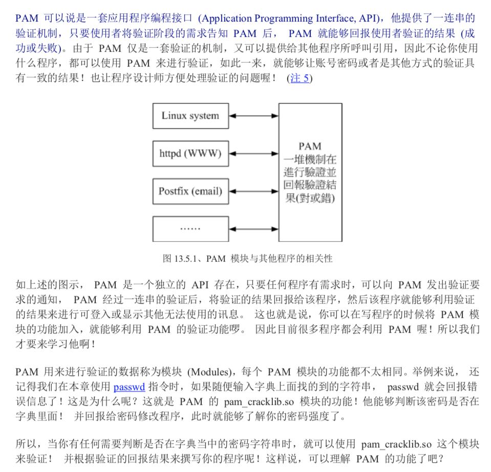
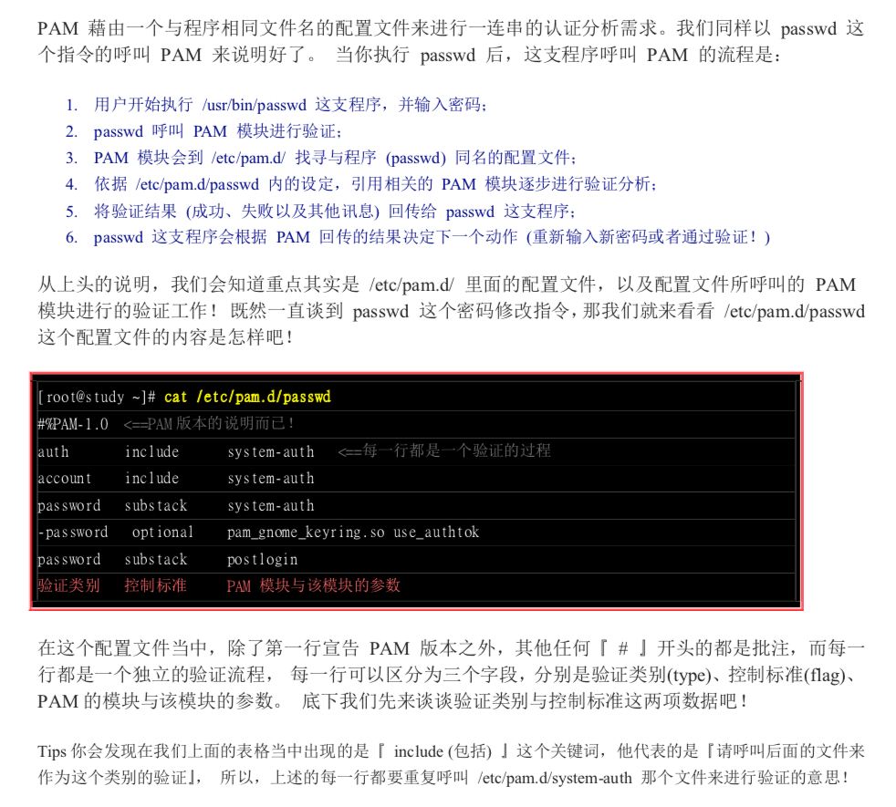
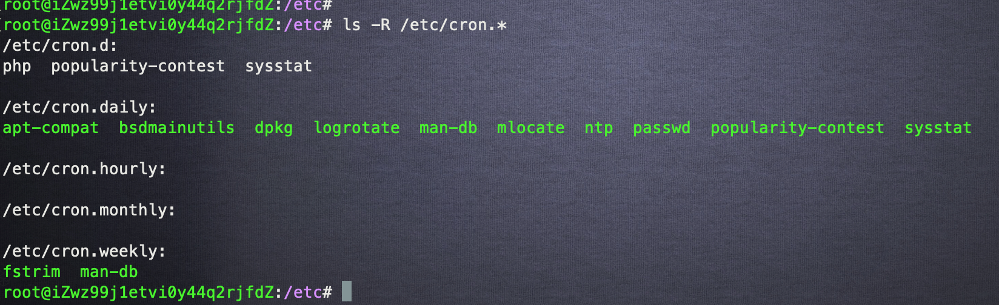
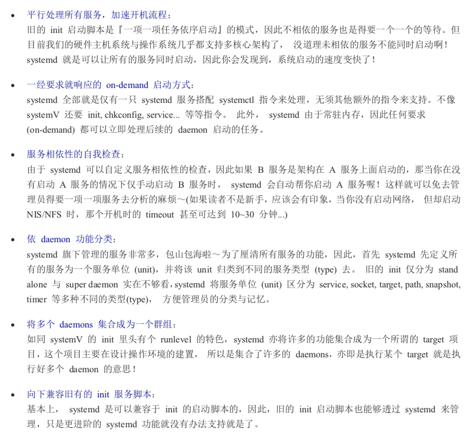
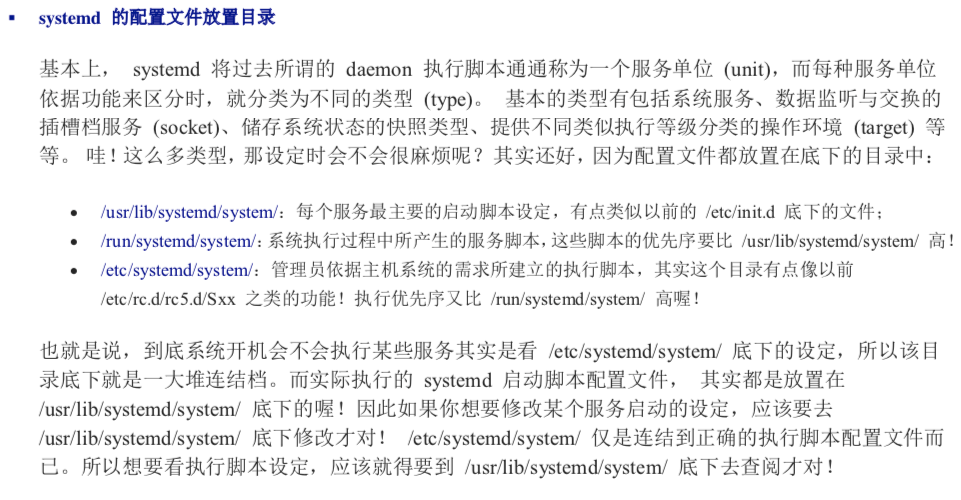
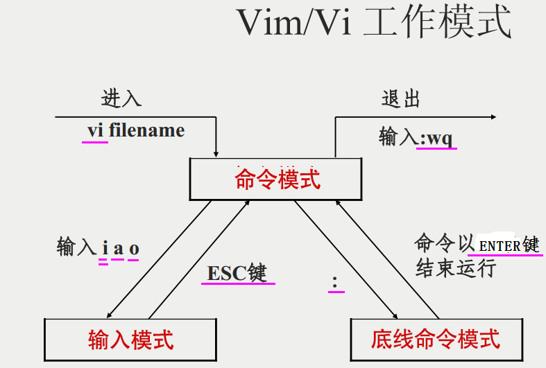

# 认识Linux
## 0.前言
1. 先介绍一个帅哥


2. 红帽系linux




## 1. 如何启动


## 2. 运行环境变量
### 2.1 我们先了解什么是Shell运行环境
* login shell：取得 bash 時需要完整的登入流程的，就称为 login shell。举例来说，你要由 tty1 ~ tty6 登入，需要輸入使用者的账号和密码，此時取得的 bash 就称为『 login shell 』；

* non-login shell：取得 bash 介面的方法不需要重复登入的举动，举例來说：
    1. 你以 X window 登入 Linux 後， 再以 X 的圖形化介面啟動終端機，此時那个終端介面並沒有需要再次的输入帐号和密码，那个 bash 的环境就称为 non-login shell了。
    2. 你在原本的 bash 環境下再次下達 bash 這個指令，同樣的也沒有輸入帐号密码， 那第二个 bash (子程序) 也是 non-login shell。

    _注_: --摘自《鸟哥的私房菜》

### 2.2 Login shell 配置的加载顺序


一般 .bash_profile均会包含如下语句。
```
if [ -n "$BASH_VERSION" ]; then
　　　　if [ -f "$HOME/.bashrc" ]; then
　　　　　　. "$HOME/.bashrc"
　　　　fi
fi
```

### 2.3 Non-login shell 加载的配置
non-login shell只会读取~/.bashrc这个文件

### 2.4 你日常使用对了吗？ 
1. 如何切换用户
    ```
    su - [user-name]
    ```
    __注意__: 中间的 - 推荐带上，不然就是non-login shell环境。
2. 编写shell脚本的注意事项：
是不是遇到过自己写的脚本可以运行，单放在crontab里就无法运行

    * 指明脚本的解释器如
        ```
        #!/bin/bash 
        ```
    * 如果脚本需要在crontab里执行，所依赖的PATH变量或其他设置要确保可以正常获取到。因为crontab属于non-login shell.
3. 判断shell环境
    ```
    echo $0
    # -bash 为login shell
    # bash 为non-login shell
    ```

## 3. 文件目录 (一切皆文件)
### 3.1 目录树
目录树的起始点为根目录 (/, root)；
每一个目录不止能使用本地端的 partition 的档案系統，也可以使用网络上的 filesystem 。举例来说， 可以利用 Network File System (NFS) 挂载某特定目录等。
每一个档案在此目录树中的文件名(包含完整路径)都是独一无二的。

如下图：


### 3.2 目录树构架都示意图


### 3.3 文件权限及特殊权限
1. 0755 （1执行、2写、4读）


2. SUID/SGID/SBIT 特殊权限
举例： 
* SUID: /usr/bin/passwd
* SGID: locate
* SBIT: /tmp目录

_注_: centos 7.x当中利用xfs 作为预设文件系统, 其仅chattr支持部分参数；

## 4. 磁盘管理
### 4.1 /etc/fstab说明

### 4.2 swap分区
```
# create swap 
$ dd if=/dev/zero of=/swap01 bs=1024 count=1048572
$ mkswap /swap01
$ swapon /swap01
```

### 4.3 fdisk/Raid/LVM
_注_: 这些知识大家根据需求针对性学习。


## 5. 包管理工具
yum（ Yellow dog Updater, Modified）是一个在Fedora和RedHat以及SUSE中的Shell前端软件包管理器。

基於RPM包管理，能够从指定的服务器自动下载RPM包并且安装，可以自动处理依赖性关系，并且一次安装所有依赖的软体包，无须繁琐地一次次下载、安装。

yum提供了查找、安装、删除某一个、一组甚至全部软件包的命令，而且命令简洁而又好记。
```
yum --help
```

## 6. 帐号管理与ACL权限设定
### 6.1 帐号管理
* 用户 useradd/usermod/userdel
* 组 groupadd/groupmod/groupdel
* 权限 chown/chgrp/chown

### 6.2 PAM模块


_注_: --摘自《鸟哥的私房菜》

## 7. 服务管理
### 7.1 例行性工作crontab
* online-update(系统升级)
* logrotate 日志轮循；
* locate 文件名数据库，可以通过```localte [file-name]```快速查找文件， 系统会主动进行updatedb 更新locate数据库；
* 更多我们下图


### 7.2 systemctl
* 前言：从Centos7.x以后，Red Hat 系列的distribution 放弃沿用多年的 System V开机启动服务的流程，改为 systemd这个启动服务管理机制。

* systemctl 好处：

_注_: --摘自《鸟哥的私房菜》
```
systemctl --help 
```
* system的配置文件放置目录

_注_: --摘自《鸟哥的私房菜》


## 7. 常用命令 grep，less, tail, vim，tar操作
### 7.1 tar
```
tar --help 
```
* eg: 打包
```
tar -zcvf img.tar.gz img1 img2
```
* eg: 解压
```
tar -zxvf img.tar.gz -C /path/dir/
```

### 7.2 vim


### 附录
1. 常用命令：grep/less/tail/head/cut/tr/awk/sed
2. 系统运维问题--常看日志

### FAQ
