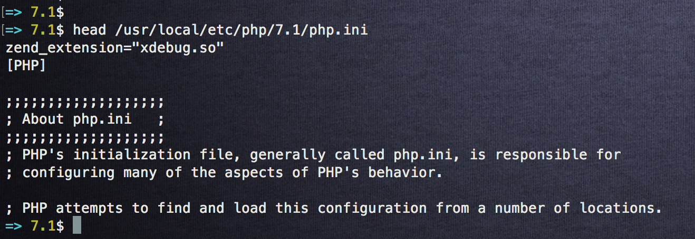

### Mac-PHP环境准备

### 前置条件
1. Mac OS 10.13.6
2. 安装Homebrew 包管理工具；
3. 安装 autoconf (解决xdebug编译依赖问题)

__说明__: brew 全称Homebrew, 是Mac OSX上的软件包管理工具


_注_: PECL（The PHP Extension Community Library）是 PHP 扩展的存储库，为 PHP所有的扩展提供提供托管和下载服务。
通过 PEAR的 Package Manager 的安装管理方式，可以对PECL扩展进行下载和安装

### 安装清单
1. php71
2. xdebug (调试)
3. nginx
4. mysql

__说明__: Mac OS默认安装了php, apache， 但是不推荐使用此默认设置，原因有二（服务配置涉及权限配置调整，没有提供方便的服务启停方式；）

#### 前置条件 - Homebrew安装
1. 安装编译依赖
```
xcode-select --install
```

2. 安装Homebrew：
```
ruby -e "$(curl -fsSL https://raw.githubusercontent.com/Homebrew/install/master/install)"
```

#### 前置条件 - autoconf
```
$ brew install autoconf
```

#### 1.php71
1. 安装
```
$ brew install php71 --without-apache  --with-fpm
```

2. 可执行文件添加至环境变量
```
echo 'export PATH="/usr/local/opt/php@7.1/bin:$PATH"' >> ~/.bash_profile
echo 'export PATH="/usr/local/opt/php@7.1/sbin:$PATH"' >> ~/.bash_profile
```

#### 2. xdebug
1. 安装

```
$ pecl install xdebug

....
Installing '/usr/local/Cellar/php@7.1/7.1.24_2/pecl/20160303/xdebug.so'
install ok: channel://pecl.php.net/xdebug-2.6.1
Extension xdebug enabled in php.ini
```

2. 配置
* 将xdebug.so 文件拷贝或是软链接至 /usr/local/opt/php@7.1/lib/php/20160303

```
$ cp /usr/local/Cellar/php@7.1/7.1.24_2/pecl/20160303/xdebug.so /usr/local/opt/php@7.1/lib/php/20160303/
```



_原因_: 因为默认安装后，php.ini配置文件会以相对路径引用，所以需要拷贝至lib库目录；也可使用绝对路径引用，就无此操作。

* xdebug示例配置，添加至php.ini
```
[xdebug]
xdebug.remote_enable = 1
xdebug.remote_port = 9000
;自动跟踪，可关闭（关闭后提升性能）
xdebug.auto_trace=On
;性能分析，可关闭（关闭后提升性能）
xdebug.profiler_enable=On
```

3. 重启php服务
```
brew services restart php@7.1
```

#### 3. nginx
1. 安装
```
$ brew install nginx
```

2. 配置

* 备份默认配置
```
$ cp /usr/local/etc/nginx/nginx.conf /usr/local/etc/nginx/nginx.conf.default
```

* 修改配置,主要修改项示例如下：
```
server {
        listen       8080;
        server_name  localhost;

        #charset koi8-r;

        access_log  logs/host.access.log  main;

	    root        [php-code-directory];

        index index.php;

        location / {
            index  index.html index.htm index.php;
        }

        #error_page  404              /404.html;

        # redirect server error pages to the static page /50x.html
        #
        error_page   500 502 503 504  /50x.html;
        location = /50x.html {
            root   html;
        }

        # pass the PHP scripts to FastCGI server listening on 127.0.0.1:9000
        #
        location ~ \.php$ {
            # root           html;
            fastcgi_pass   127.0.0.1:9000;
            fastcgi_index  index.php;
            # fastcgi_param  SCRIPT_FILENAME  /scripts$fastcgi_script_name;
            fastcgi_param  SCRIPT_FILENAME  $document_root$fastcgi_script_name;
            include        fastcgi_params;
        }

        # deny access to .htaccess files, if Apache's document root
        # concurs with nginx's one
        #
        location ~ /\.ht {
            deny  all;
        }
    }
```


#### 4. mysql（根据需要）
1. 安装
```
brew install mysql mysql-client
```

2. 配置 mysql-client 添加至环境变量

```
If you need to have mysql-client first in your PATH run:
  echo 'export PATH="/usr/local/opt/mysql-client/bin:$PATH"' >> ~/.bash_profile

For compilers to find mysql-client you may need to set:
  export LDFLAGS="-L/usr/local/opt/mysql-client/lib"
  export CPPFLAGS="-I/usr/local/opt/mysql-client/include"
```


#### 5.服务管理
1. 重启php@71
```
$ brew services restart php@7.1
```

2. 重启nginx
```
$ brew services restart nginx
```

3. nginx也可通过如下命令reload
```
$ nginx -t
$ nginx -s reload
```

4. 重启mysql 服务
```
brew services restart mysql
```

#### 常见问题
1. 安装xdebug过程中遇到权限问题，请开启如下设置
按住command+R，打开命令行，输入：```csrutil disable``` 然后，重启Mac系统

否则，没有权限操作/usr/文件夹下的内容；

配置好xdebug后，再修改回来，```csrutil enable```

0.2 安装xdebug时的，error，xdebug.c:25:10: fatal error: 'php.h' file not found
```
$ xcode-select --install
```

```
sudo ln -s /Applications/Xcode.app/Contents/Developer/Platforms/MacOSX.platform/Developer/SDKs/MacOSX10.14.sdk/usr/include /usr/include
```
_注_: 将MacOSX10.14替换成你自己的系统版本号

[返回首页](/index.html)