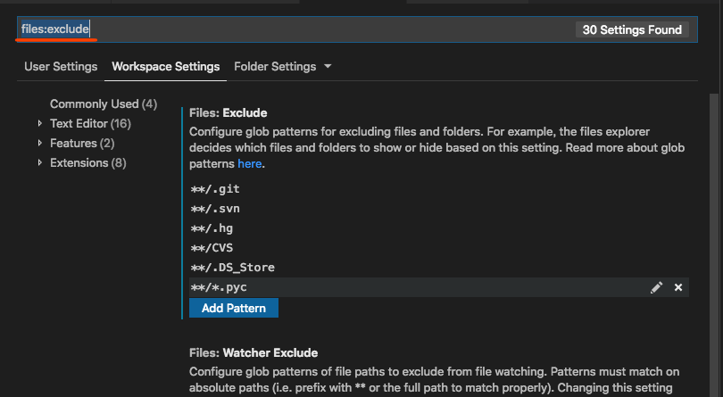

# VS Code 开发环境设置

## 运行环境
* Mac os 10.13.6
* VS code 1.31.1

## 常用设置
### 1. 隐藏.pyc文件
* 调整Workspace Settings添加如下图，

__设置路径__：Code -> Preferences -> Settings -> Workspace Settings, Search Settings

[返回首页](/index.html)