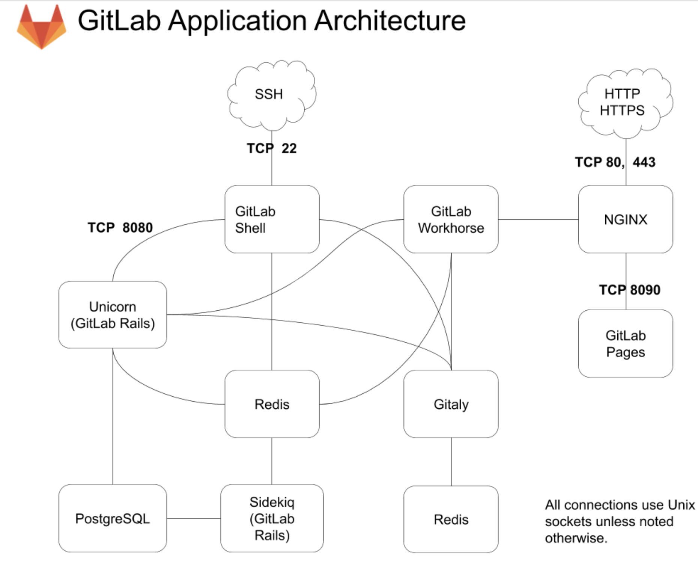

[返回首页](/index.html)
### 前言
1. 本文Gitlab的安装为主机方式, 获取其他安装方式[请点击](https://git.lug.ustc.edu.cn/help/install/README.md)


## 架构


### 架构概述：
* Unicorn: Handles requests for the web interface and API, 一般gitlab站点，多数是因为这个服务有问题导致的
* Sidekiq: Background jobs processor
* Redis: Caching service
* PostgreSQL: Database


## 安装
### 1. 设置repo
cat > /etc/yum.repos.d/gitlab-ce.repo << EOF
[gitlab-ce]
name=Gitlab CE Repository
baseurl=https://mirrors.tuna.tsinghua.edu.cn/gitlab-ce/yum/el$releasever/
gpgcheck=0
enabled=1
EOF

### 2. 安装gitlab

```
$ yum makecache
$ yum install gitlab-ce
```

### 3. 修改配置

配置文件```/etc/gitlab/gitlab.rb ```
_注_: 你可根据注释修改配置文件，一般修改如下

```
external_url 'http://gitlab.xxxxxx.com' #改域名,修改成你自己的域名,如果你用的https，改成https://gitlab.xxxxxx.com
```

### 4. 启动服务

```
$ gitlab-ctl reconfigure  ## 使配置生效
$ gitlab-ctl status  ## 确认服务状态
```

## 如何备份

### 1. 设置备份目录
先打开```/etc/gitlab/gitlab.rb```配置文件，查看一个和备份相关的配置项：

```
gitlab_rails['backup_path'] = "/var/opt/gitlab/backups"
```

该项定义了默认备份出文件的路径，可以通过修改该配置，并执行 ```gitlab-ctl reconfigure``` 或者 ```gitlab-ctl  restart``` 重启服务生效。

### 2. 执行备份
备份执行一条命令就搞定：```/opt/gitlab/bin/gitlab-rake gitlab:backup:create``` ，
也可以加到crontab中定时执行：

```
0 2 * * * /opt/gitlab/bin/gitlab-rake gitlab:backup:create
```

可以到 ```/var/opt/gitlab/backups```找到备份包，解压查看，会发现备份的还是比较全面的，数据库、repositories、build、upload等分类还是比较清晰的。

### 3. 备份参数注释 
每天执行备份，肯定有目录被爆满的风险，我们可以立马想到的可以通过find 查找一定的时间前的文件，配合rm进行删除。不过不需要这么麻烦，gitlab-ce自身集成的有自动删除配置。同样打开/etc/gitlab/gitlab.rb配置文件，可以找到如下配置：

gitlab_rails['backup_keep_time'] = 604800
这里是设置备份保留7天（7*3600*24=604800），秒为单位，如果想增大或减小，可以直接在该处配置，并通过gitlab-ctl restart 重启服务生效。


## Gitlab迁移或数据恢复


### 1. 恢复前需要先停掉数据连接服务：

```
gitlab-ctl stop unicorn
gitlab-ctl stop sidekiq
```

如果是台空主机，没有任何操作，理论上不停这两个服务也可以。停这两个服务是为了保证数据一致性。

### 2. 迁移数据
如果你没修改过默认备份目录的话，将老服务器```/var/opt/gitlab/backups```目录下的备份文件拷贝到新服务器上的```/var/opt/gitlab/backups```

```
[root@localhost gitlab]# scp 1530773117_2018_07_05_gitlab_backup.tar 10.0.3.111:/var/opt/gitlab/backups/
 
## 600权限是无权恢复的。 --- 这里改成了777

[root@localhost backups]# pwd
/var/opt/gitlab/backups
[root@localhost backups]# chmod 777 1530773117_2018_07_05_gitlab_backup.tar 
[root@localhost backups]# ll
total 17328900
-rwxrwxrwx 1 git git 17744793600 Jul  5 14:47 1530773117_2018_07_05_gitlab_backup.tar
```


### 3. 执行数据恢复

执行下面的命令进行恢复：后面再输入两次yes就完成恢复了。

```
gitlab-rake gitlab:backup:restore BACKUP=1530773117_2018_07_05_gitlab_backup.tar
 
```

PS:根据版本不同恢复时可能有点小区别


## 附录1. 常用命令
```
# 默认的log主目录为 /var/log/gitlab/

# 检查redis的日志
sudo gitlab-ctl tail redis

# 检查postgresql的日志
sudo gitlab-ctl tail postgresql

# 检查gitlab-workhorse的日志
sudo gitlab-ctl tail gitlab-workhorse

# 检查logrotate的日志
sudo gitlab-ctl tail logrotate
# 检查nginx的日志
sudo gitlab-ctl tail nginx

# 检查sidekiq的日志
sudo gitlab-ctl tail sidekiq

# 检查unicorn的日志
sudo gitlab-ctl tail unicorn


sudo gitlab-ctl status  //检查所依赖的服务是否运行
sudo gitlab-ctl tail //检查gitlab所依赖的服务是否在运行时出错


sudo gitlab-rake gitlab:check //检查的配置是否正确，如果有错误，请根据提示解决它
```


## FAQ
1. 错误1

```
error: proxyRoundTripper: GET "/" failed with: "dial unix /var/opt/gitlab/gitlab-rails/sockets/gitlab.socket: connect: no such file or directory"
```

* 原因： unicorn 没有正常启动
* 解决： 查看unicorn的日志， ```/var/log/gitlab/unicorn/*.log```, 一般为端口冲突或是权限问题。依赖相应的日志，希望你可以很好的解决，enjoy it.


## 参考文档
1. https://docs.gitlab.com/ee/development/architecture.html